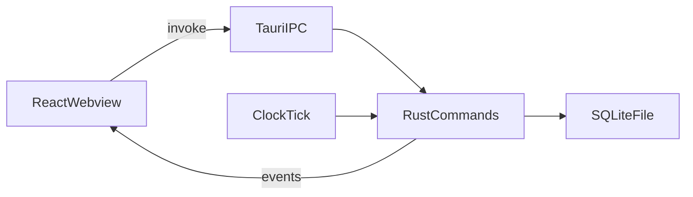

# Architecture

Yuli Todo v1 is a **Windows desktop** app: a Tauri webview plus a Rust core, talking only to a local SQLite file. This document is the implementation contract. It is not a license to start coding during the design phase.

The stack below is **locked**. Do not add a library from the rejected list without a spec change.

## Locked stack

| Layer | Choice |
| --- | --- |
| OS | Windows 10 / 11, x64 only |
| Shell | Tauri **2** (webview + Rust). WebView2 as provided by Tauri |
| Toolchain | Rust **stable**, Node **LTS**, package manager **npm** |
| Frontend | **React 18+** (whatever `create-tauri-app` scaffolds) + **TypeScript** (`strict`) + **Vite** |
| Navigation | No React Router. A view union: `board` \| `scheduled` \| `archive` \| `settings` in React state |
| Styling | **CSS Modules** + one global token stylesheet. Theme/scheme via `data-theme` / `data-scheme` and [theming.md](theming.md) variables. No Tailwind, no CSS-in-JS |
| Components | **Fully custom**. Dialogs, context menus, focus trap, Escape/overlay dismiss — written in-app to match [ux-spec.md](ux-spec.md) |
| Drag and drop | `@dnd-kit/core` and `@dnd-kit/sortable` |
| i18n | Custom loader over `locales/en.json` and `locales/zh-CN.json`. No i18next |
| Dates | Native `Date`, `Intl.DateTimeFormat`, and `<input type="datetime-local" step="60">`. No date-fns / Day.js / Moment |
| Client state | React context for settings/locale/view. Task lists fetched after commands and on `tasks-changed`. No Redux, Zustand, or TanStack Query |
| Persistence | **SQLite** via **`rusqlite`** (bundled SQLite) **inside Rust commands only**. The webview never opens the db |
| Rust crates (core) | `rusqlite`, `serde` / `serde_json`, `uuid`, `chrono`, `thiserror`, `tokio` (clock tick) |
| IDs | UUID v4 generated in **Rust** on create |
| Tests | `cargo test` for transitions and the Doing timer; **Vitest** + **React Testing Library** for Done-confirm cancel |
| Identity / network | None. No HTTP client crate, no `fetch` to the internet |

### Explicitly rejected (v1)

- Tailwind, Sass/SCSS (unless a single file becomes unmaintainable — still no Tailwind)
- Ant Design, MUI, Chakra, shadcn, Radix, Base UI, Headless UI
- `tauri-plugin-sql` (SQL from the frontend would bypass the command layer)
- React Router, i18next, Zustand, Redux, TanStack Query
- date-fns, Day.js, Moment, Temporal polyfills
- Electron, Next.js, Vue, Svelte
- Cloud SDKs, auto-updater that hits the network

The UI is four screens switched by view state, not URL routes. Deep linking is not a v1 requirement.

## Process shape



- All writes go through Rust commands. The webview does not open the SQLite file itself.
- The clock tick (see [data-model.md](data-model.md)) runs in Rust on a 60-second interval and on startup, then emits a `tasks-changed` event so the UI refetches.
- Commands return JSON DTOs that match the field names in the data model (`start_at`, `board_column`, …).

Suggested command set (names are stable English identifiers):

- `list_tasks({ surface })` where `surface` is `board` | `scheduled` | `archive`
- `get_task({ id })`
- `create_task(...)`
- `update_task(...)`
- `move_task({ id, to_column })` — enforces Done confirmation happened in UI; still re-validates transitions
- `archive_now({ id })`
- `delete_task({ id })` — rejects if not archived
- `list_types` / `create_type` / `rename_type` / `delete_type`
- `get_settings` / `update_settings`

The UI may still ask “Move to Done?” before calling `move_task`. The backend must reject illegal moves even if the UI is bypassed.

## Data location

- Database: under the Tauri **app data** directory, for example `%APPDATA%\<bundle-identifier>\yuli-todo.sqlite`.
- Bundle identifier (proposal): `com.yuli.todo`.
- No documents-folder scanning. No other files required for v1.

Backups are a user problem (copy the sqlite file). The app does not upload it.

## Offline and capabilities

v1 must run with the network unplugged.

Tauri capabilities (frontend):

- Allow: window and path. Prefer keeping all file access in Rust so the webview has **no** fs or sql APIs.
- Deny: HTTP client, arbitrary filesystem, shell open of remote URLs, updater that hits the network, `tauri-plugin-sql`

Webview CSP:

- `default-src 'self'`
- `style-src 'self' 'unsafe-inline'` only if Vite requires it in dev; production should stay tight
- No `connect-src` to http/https except Vite’s localhost in development

The frontend must not call `fetch` against the public internet.

## Time

- Wall clock: local timezone in the UI.
- Storage: UTC ISO strings as in the data model.
- Tick: `tokio` interval or equivalent, 60s, plus an immediate run after DB open.
- If the system clock jumps, the next tick reconciles (promote, overdue, archive). No attempt to detect clock tampering.

## State in the webview

Keep it small:

- `AppView`, settings, and locale in a React context
- Task lists fetched per screen; invalidate on `tasks-changed` and after successful commands
- No offline replica besides SQLite — the file is the source of truth
- No client-side router cache or normalized entity store

## Theming runtime

- `data-theme` and `data-scheme` on `<html>`
- Global `tokens.css` (or per-theme files imported once) defining the `--yl-*` variables from [theming.md](theming.md)
- Component styles as `*.module.css` that **only** reference those variables (no raw hex)
- Fonts bundled under `src/assets/fonts/` with `@font-face` (no CDN)
- Dialogs and menus: custom components with focus trap, restore focus, Escape, and overlay click per [ux-spec.md](ux-spec.md). A React portal to `document.body` is enough; no portal library

## i18n runtime

- Tiny in-app helper: load `en.json` always; load `zh-CN.json` when selected
- Key lookup with English fallback; `{name}` replacement is enough (no i18next)
- Status and column labels come from catalogs, not from enum names
- Catalogs are bundled with the frontend (Vite import). They are not fetched from the network

## Error handling

- Command failures return a structured `{ code, messageKey }` so the UI can localize
- Codes include `NOT_ARCHIVED`, `TYPE_IN_USE`, `VALIDATION`, `NOT_FOUND`, `STORAGE`
- `STORAGE` on startup shows the blocking error in [ux-spec.md](ux-spec.md)

## Testing (implementation phase)

- Rust (`cargo test`, in-memory `rusqlite`) for the transition table in [data-model.md](data-model.md)
- Rust unit tests for `flush_doing` / `start_doing` (pause on To Do, resume on Doing, direct To Do → Done stays `0`, force-end from Doing includes the open session, clock jump backward adds `0`)
- Vitest + React Testing Library: Done-confirm cancel must not call `move_task`
- No Playwright/Cypress requirement in v1; the Rust transition tests are not optional

## Repository layout (future)

Not created in the design phase. When scaffolding starts, prefer:

```
docs/                 (this design set)
src/                  React + CSS Modules + token CSS
src/assets/fonts/     self-hosted woff2
src-tauri/            Rust, rusqlite, commands, clock tick
locales/en.json
locales/zh-CN.json
```

Scaffold with the official Tauri 2 React + TypeScript Vite template, then delete unused sample UI. Do not add Tailwind even if the template offers it.

## Security notes (personal, still local)

- No secrets, no tokens
- SQL via bound parameters only
- Delete is hard delete; v1 has no extra confirmation beyond the dialog (no typed-name challenge)
