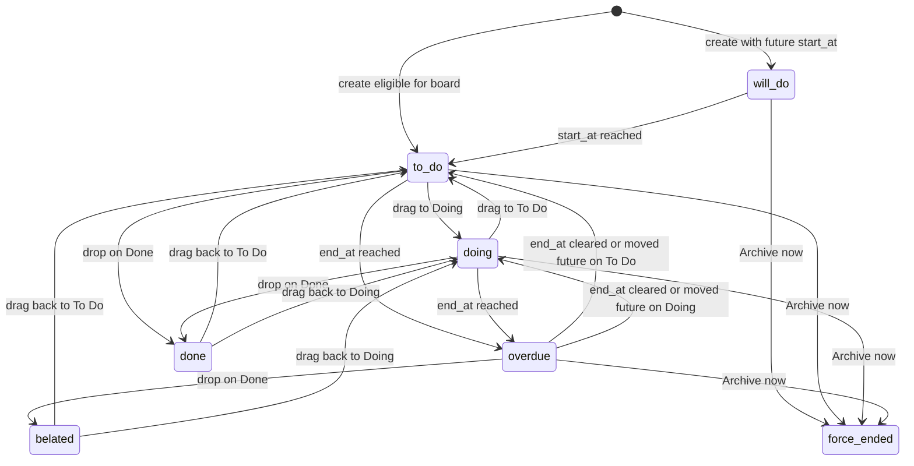

# Data model

This document is the persistence contract for Yuli Todo v1. Product rules are in [product-spec.md](product-spec.md). Implementation uses local SQLite as described in [architecture.md](architecture.md).

## Identifiers and time

- Primary keys are UUID v4 strings (canonical lowercase).
- All timestamps are stored as ISO-8601 in **UTC** with minute precision for `start_at` / `end_at` (seconds `00`) and second precision for audit fields.
- The UI converts to the local timezone. Never show raw UTC to the user.
- `start_at` and `end_at` are nullable. Empty UI fields persist as `NULL`, not sentinel dates.

## Enumerations

### `TaskStatus`

```
will_do | to_do | doing | done | overdue | belated | force_ended
```

### `BoardColumn`

```
todo | doing | done
```

Stored as `NULL` when the task is on Scheduled (`will_do` and not archived).

### `ThemeId`

```
metal | claude | vscode | github | tiktok
```

### `ColorScheme`

```
light | dark | system
```

### `LocaleId`

```
en | zh-CN
```

## Tables

### `task_types`

| Column | Type | Rules |
| --- | --- | --- |
| `id` | TEXT PK | UUID |
| `name` | TEXT | Unique among types, trimmed, 1–40 characters |
| `sort_order` | INTEGER | Display order in pickers |
| `created_at` | TEXT | ISO UTC |
| `updated_at` | TEXT | ISO UTC |

Seed row on first launch: name `General`.

### `tags`

| Column | Type | Rules |
| --- | --- | --- |
| `id` | TEXT PK | UUID |
| `name` | TEXT | Unique **case-insensitive**, trimmed, 1–40 characters |
| `created_at` | TEXT | ISO UTC |

The first casing written is the display name.

### `tasks`

| Column | Type | Rules |
| --- | --- | --- |
| `id` | TEXT PK | UUID |
| `name` | TEXT | Required, trimmed, 1–200 characters |
| `type_id` | TEXT NULL | FK `task_types.id` ON DELETE RESTRICT |
| `content` | TEXT | Default `''`, max 20_000 |
| `notes` | TEXT | Default `''`, max 20_000 |
| `start_at` | TEXT NULL | UTC minute |
| `end_at` | TEXT NULL | UTC minute; if both set, `end_at >= start_at` |
| `status` | TEXT | `TaskStatus` |
| `board_column` | TEXT NULL | `BoardColumn` or NULL |
| `doing_elapsed_seconds` | INTEGER | Default `0`, never negative. Accumulated wall time in the Doing column with the open session flushed |
| `doing_started_at` | TEXT NULL | UTC. Set while `board_column = 'doing'` and `archived_at IS NULL`; otherwise NULL |
| `completed_at` | TEXT NULL | Set when entering Done or force-ending |
| `archived_at` | TEXT NULL | Set when archived |
| `created_at` | TEXT | ISO UTC |
| `updated_at` | TEXT | ISO UTC |

Indexes:

- `(archived_at, board_column, status)`
- `(status, start_at)` for Scheduled promotion
- `(status, end_at)` for overdue
- `(status, completed_at)` for auto-archive

### `task_tags`

| Column | Type | Rules |
| --- | --- | --- |
| `task_id` | TEXT | FK `tasks.id` ON DELETE CASCADE |
| `tag_id` | TEXT | FK `tags.id` ON DELETE RESTRICT |
| Primary key | | `(task_id, tag_id)` |

Orphan tags (no remaining links) may be kept for autocomplete. v1 does not require garbage-collecting them.

### `settings`

Single-row table (`id = 1`) or key-value store. Required keys:

| Key | Type | Default |
| --- | --- | --- |
| `archive_after_days` | INTEGER | `3` (constraint 0–365) |
| `locale` | TEXT | `en` |
| `theme_id` | TEXT | `metal` |
| `color_scheme` | TEXT | `system` |
| `font_size` | INTEGER | `13` (constraint 12–18) |

Schema version lives in SQLite `user_version` or a `schema_migrations` table. v1 starts at version `1`.

## Invariants

1. `archived_at IS NULL` XOR the task is listed on Archive. Board and Scheduled queries always include `archived_at IS NULL`.
2. If `status = 'will_do'` then `archived_at IS NULL` and `board_column IS NULL` and `start_at IS NOT NULL`.
3. If `status = 'to_do'` then `board_column = 'todo'`. If `status = 'doing'` then `board_column = 'doing'`. If `status = 'overdue'` then `board_column IN ('todo','doing')`. All three require `archived_at IS NULL`.
4. If `status = 'overdue'` then `board_column IN ('todo','doing')` and `end_at IS NOT NULL`.
5. If `status IN ('done','belated')` and `archived_at IS NULL` then `board_column = 'done'` and `completed_at IS NOT NULL`.
6. If `status = 'force_ended'` then `archived_at IS NOT NULL` and `completed_at IS NOT NULL`.
7. `overdue` never shares the Done column. Completing overdue work writes `belated`.
8. `will_do` never has `board_column` set.
9. `doing_started_at IS NOT NULL` only when `archived_at IS NULL` and `board_column = 'doing'`.
10. `doing_elapsed_seconds >= 0`. Leaving Doing or completing always flushes the open session into this column before clearing `doing_started_at`.
11. If `status IN ('done','belated','force_ended')` then `doing_started_at IS NULL` and `completed_at IS NOT NULL`.

These invariants are enforced in the application layer. SQL CHECK constraints should mirror the enums and the `end_at >= start_at` rule.

## Status and column machine

Column and status are updated together. `overdue` is a status overlay on `todo` or `doing`.



### Doing timer

Duration is derived, not typed. Helpers (same `now` for the whole command):

```
flush_doing(task, now):
  if task.doing_started_at is not null:
    task.doing_elapsed_seconds += max(0, seconds(now - task.doing_started_at))
    task.doing_started_at = null

start_doing(task, now):
  if task.doing_started_at is null:
    task.doing_started_at = now
```

Call `flush_doing` whenever the card leaves column `doing` (To Do, Done, Scheduled, Archive now). Call `start_doing` whenever it enters column `doing`. Status `overdue` does not by itself flush or start the timer; only `board_column` does.

Displayed duration for Done and Archive is `doing_elapsed_seconds` after flush. Do not add a live open session on those surfaces — they are never in Doing.

If the clock jumps backward, treat a negative delta as `0`. Time spent in Doing while the app is closed still counts, because `doing_started_at` persists.

`archived` is not a status. Archive is `archived_at IS NOT NULL`.

### Transition table (application logic)

Let `due = end_at != null && end_at <= now`.

| Event | From | To status | To column | Extra |
| --- | --- | --- | --- | --- |
| Create, start in future | — | `will_do` | `NULL` | |
| Create, start empty or past; not due | — | `to_do` | `todo` | |
| Create, start empty or past; due | — | `overdue` | `todo` | |
| Scheduler: start reached; not due | `will_do` | `to_do` | `todo` | |
| Scheduler: start reached; due | `will_do` | `overdue` | `todo` | |
| Scheduler: end reached | `to_do` or `doing` | `overdue` | unchanged | Timer unchanged (still follows column) |
| Drag to Doing | `to_do` | `doing` | `doing` | `start_doing` |
| Drag to Doing | `overdue` | `overdue` | `doing` | `start_doing` |
| Drag to To Do | `doing` | `to_do` | `todo` | `flush_doing` |
| Drag to To Do | `overdue` | `overdue` | `todo` | `flush_doing` |
| Confirm drop on Done | `overdue` | `belated` | `done` | `flush_doing`; `completed_at = now` |
| Confirm drop on Done | `to_do` or `doing` | `done` | `done` | `flush_doing`; `completed_at = now` |
| Drag from Done to To Do | `done` or `belated` | `overdue` if due else `to_do` | `todo` | `completed_at = NULL`; keep `doing_elapsed_seconds` |
| Drag from Done to Doing | `done` or `belated` | `overdue` if due else `doing` | `doing` | `completed_at = NULL`; keep elapsed; `start_doing` |
| Save: start moved to future | any active except need archive | `will_do` | `NULL` | `flush_doing`; clear `completed_at` |
| Archive now incomplete | `will_do`, `to_do`, `doing`, `overdue` | `force_ended` | last column kept if any | `flush_doing`; `completed_at` and `archived_at = now` |
| Archive now from Done | `done` or `belated` | unchanged | `done` | `archived_at = now`; duration unchanged |
| Auto-archive | `done` or `belated` | unchanged | `done` | `archived_at = now` when delay elapsed |

Invalid: user-facing status picker that writes `done` without going through the Done confirmation; deleting a non-archived row; restoring `archived_at` to `NULL` in v1.

## Scheduler

Name: **clock tick**.

1. Run on app start after DB open.
2. Run every 60 seconds while the window exists.
3. In one transaction, in order:
   1. Promote eligible `will_do` (including same-pass overdue).
   2. Mark board `to_do` / `doing` as `overdue` when `end_at` due.
   3. Set `archived_at` on `done` / `belated` where `completed_at <= now - archive_after_days`.

Do not archive `force_ended` here; they are archived in the same write as the status change.

## Delete

`DELETE FROM tasks WHERE id = ? AND archived_at IS NOT NULL`.

The application must refuse otherwise. Tag rows cascade. Types do not.

## Derived queries

- Board column `todo`: `archived_at IS NULL AND board_column = 'todo'`
- Board column `doing`: `archived_at IS NULL AND board_column = 'doing'`
- Board column `done`: `archived_at IS NULL AND board_column = 'done'`
- Scheduled: `archived_at IS NULL AND status = 'will_do'` ORDER BY `start_at`
- Archive: `archived_at IS NOT NULL` ORDER BY `archived_at` DESC

Do not derive column from status alone. `overdue` would be ambiguous.
